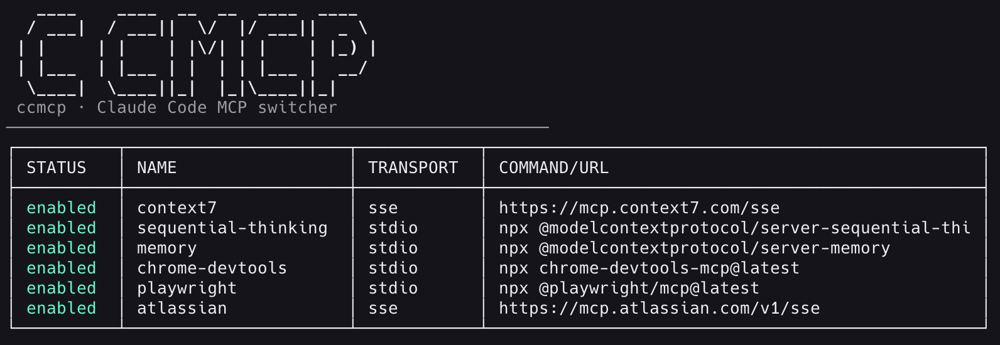
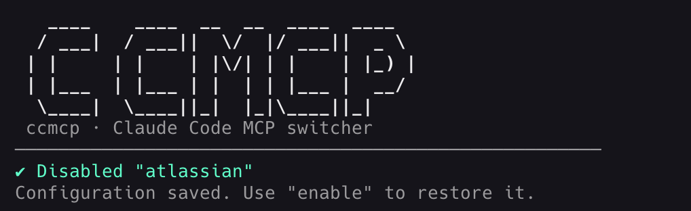

# claude-mcp-switch - Claude Code MCP switcher

A zero-dependency npx CLI to list, enable, and disable Claude Code MCP servers.
Uses the `claude` CLI under the hood to ensure compatibility with your actual running configuration.


## ✨ Features

- List active and disabled MCP servers (powered by `claude mcp list`)
- Enable/disable servers by name
- Preserves server configuration when disabling for easy re-enabling
- JSON output and dry-run mode
- Works with all transport types: stdio, SSE, HTTP
- Attractive UI: ASCII banner, colorized output, and box-drawn tables
- Color control: auto-detect TTY, disable with --no-color or NO_COLOR=1; always off in --json

## 📋 Requirements

- Node.js >= 18
- Claude Code CLI installed and configured (`claude` command available)
- At least one MCP server configured in Claude Code

## 🚀 Install / Use

- **Local npx usage** (no installation required):
  1. List servers: `npx claude-mcp-switch list`
  2. Enable server: `npx claude-mcp-switch enable github`
  3. Disable server: `npx claude-mcp-switch disable github --dry-run`
- **Global install via npm**:
  1. Install globally: `npm install -g claude-mcp-switch`
  2. Use the tool: `ccmcp list`
  3. Enable MCP: `ccmcp enable github`
  4. Disable MCP: `ccmcp disable github`
- **Local development (no registry)**:

  1. Clone the repo locally:
     - `git clone <repo-url>` and `cd claude-mcp-switch`
  2. Ensure the CLI entrypoint is executable:
     - macOS/Linux: `chmod +x ./src/ccmcp.js` (shebang is present in [src/ccmcp.js](src/ccmcp.js:1))
  3. Link globally to use the `ccmcp` command anywhere:
     - `npm link` (uses the bin mapping in [package.json](./package.json:6))
  4. Use the tool:
     - `ccmcp list`
     - `ccmcp enable github`
     - Disable color during tests: `ccmcp list --no-color`
  5. Unlink when done:
     - `npm unlink -g ccmcp` (or run `npm unlink` inside the project)

- **Alternative: run directly without linking**
  - macOS/Linux:
    - `node ./src/ccmcp.js list`
    - `node ./src/ccmcp.js enable github --config ~/.claude/settings.json`
  - Windows (CMD):
    - `node .\src\ccmcp.js list`
    - `node .\src\ccmcp.js enable github --config %USERPROFILE%\.claude\settings.json`
  - Windows (PowerShell):
    - `node .\src\ccmcp.js list`
    - `node .\src\ccmcp.js enable github --config "$env:USERPROFILE\.claude\settings.json"`

## 💻 Commands

- list [--json] [--no-color]
  - Prints a colorized, boxed table with STATUS, NAME, TRANSPORT, COMMAND/URL
  - Shows both active (from `claude mcp list`) and disabled servers (from local storage)
    
- enable <name> [--dry-run] [--json] [--no-color]
  - Re-enables a previously disabled server by restoring its configuration
    
- disable <name> [--dry-run] [--json] [--no-color]
  - Disables a server by removing it via `claude mcp remove` and storing its config for later re-enabling
    
- --help, --version

## 🎯 How it works

- **List**: Executes `claude mcp list` to get active servers, merges with locally stored disabled servers
- **Disable**:
  1. Fetches server details via `claude mcp get <name>`
  2. Stores configuration in `~/.claude-mcp-switch/disabled-servers.json`
  3. Removes server via `claude mcp remove <name>`
- **Enable**:
  1. Retrieves stored configuration from local storage
  2. Re-adds server via `claude mcp add` with original settings
  3. Removes from disabled storage

## 🔍 Configuration

No configuration file discovery needed! The tool uses the `claude` CLI which automatically uses your active Claude Code configuration. This ensures the tool always works with your actual running MCP servers.

## 🚪 Exit codes

- 0: success
- 2: server not found
- 4: error executing claude CLI command

## 📝 Examples

- List all servers:
  ```bash
  npx claude-mcp-switch list
  ```
- Disable a server:
  ```bash
  npx claude-mcp-switch disable playwright
  ```
- Enable a previously disabled server:
  ```bash
  npx claude-mcp-switch enable playwright
  ```
- Dry-run mode:
  ```bash
  npx claude-mcp-switch disable playwright --dry-run
  ```
- JSON output:
  ```bash
  npx claude-mcp-switch list --json
  ```

## 📊 JSON output

- **List**: Outputs array of server objects with status, name, transport, commandOrUrl
- **Enable/Disable**: Outputs { ok, action, identifier, error? }

## 🔧 Troubleshooting

- **"claude: command not found"**: Ensure Claude Code CLI is installed and in your PATH
- **Server not found**: Use `claude mcp list` to see available servers, or `npx claude-mcp-switch list` to see both active and disabled servers
- **Permission errors**: Ensure you have write access to `~/.claude-mcp-switch/` directory

## 📚 Reference

- Claude Code MCP: https://docs.claude.com/en/docs/claude-code/mcp
- Claude CLI documentation: https://docs.claude.com/en/docs/claude-code/cli

## 🧪 Testing

The project uses Node.js built-in test runner (Node 18+) with comprehensive unit and integration tests.

### Running Tests

```bash
# Run all tests
npm test

# Run unit tests only
npm run test:unit

# Run integration tests only
npm run test:integration

# Watch mode
npm run test:watch

# Coverage report
npm run test:coverage
```

### Test Coverage

- Unit tests for all modules (utils, config, schema, matcher, ui)
- Integration tests for CLI commands
- End-to-end tests with temp config files
- Platform-specific path resolution tests
- Error handling and edge case coverage

## 📄 License

MIT

## 🤖 GitHub Workflows

This project includes comprehensive CI/CD automation with multiple GitHub Actions workflows. See [CI/CD Workflows](./doc/CI_WORKFLOWS.md) for detailed documentation.
